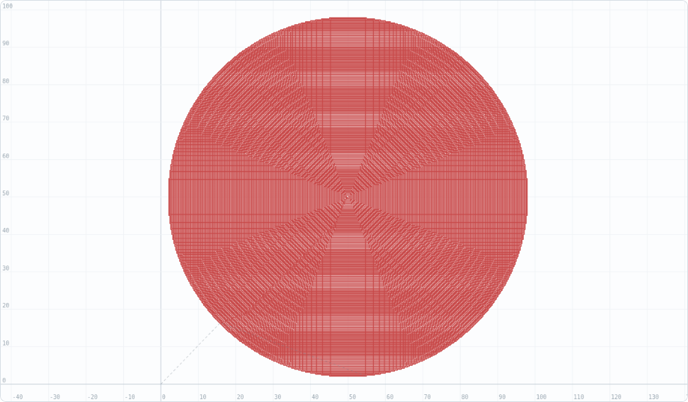
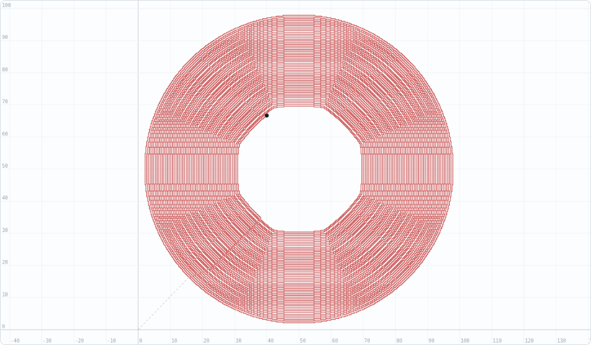
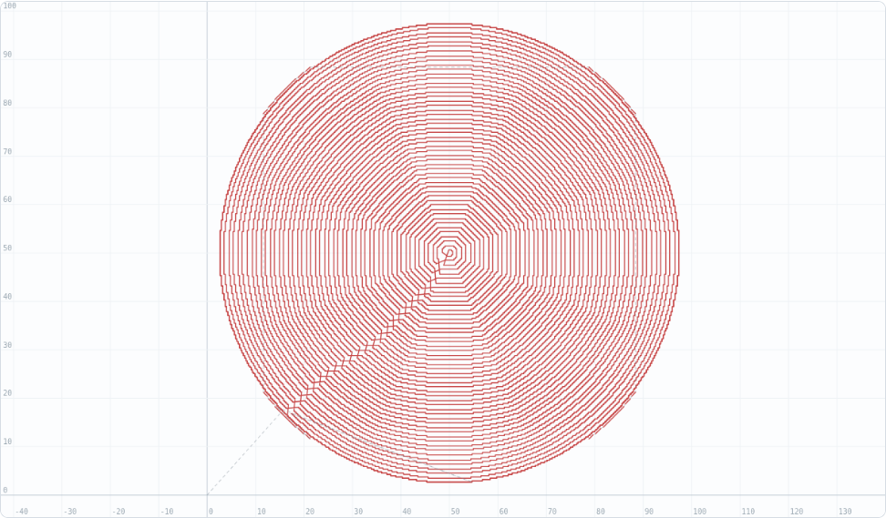
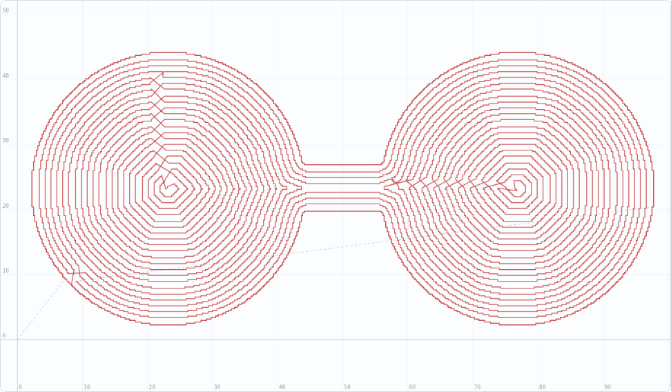
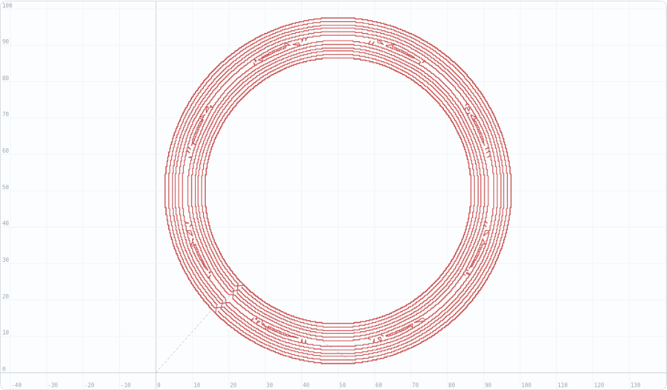
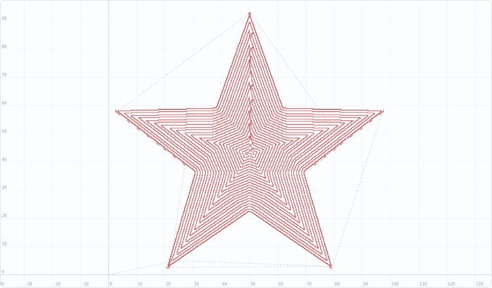

# Connected Fermat Spirals: Implementation Writeup

This document records how the `fermat` pocket strategy was built and what each verification image shows. The algorithm design and its decision records are in the design doc; this is the build narrative.

## Stage 1 — the pieces we already had

The paper's input structure ("iso-contours of the Euclidean distance transform with spacing w") is exactly what `collectRings` produces from the chamfer distance field. The implementation therefore begins with a refactor, not new geometry: ring collection was extracted from `makeContourPocketPaths` so both strategies fill identical lanes, including the 1px step floor and duplicate-level dedupe from MILL-02.

## Stage 2 — loop forest and chains (Step A)

`buildLoopForest` attaches each level-k+1 loop to the *nearest* level-k loop. Containment parenting was rejected during design because an annular pocket has two boundary families (outer shrinking, inner growing) whose loops would both be "contained" in the wrong predecessors; nearest-loop parenting keeps each family in its own lineage. `decomposeChain` then cuts the forest into single-child lineages — the paper's spirallable regions — with branch points spawning child chains.

## Stage 3 — the Fermat path for one chain (Steps B+C)

`fermatChainPath` implements the arc/gap/corridor construction: aligned anchors form a radial corridor, every loop contributes its circumference minus a 2-stepover gap at the corridor, the inward pass rides even lanes crossing odd gaps two lanes at a time, the outward pass rides odd lanes back. The construction was verified numerically before trusting any picture: on a 200px disk the path's radius profile descends 77 → 2 over the first 53% of arc length, has a single minimum at the center turn, ascends back to 75, and the endpoints land 6.7px apart on the two outermost lanes.

```
radius profile (41 samples along the path):
77 77 78 78 69 71 71 70 63 63 62 54 54 54 48 46 38 38 31 29 22
 6 19 28 35 34 43 42 50 51 49 58 60 66 66 67 65 75 75 75 74
```

The first rendered check used real engraving parameters (30° bit, 0.03mm stepover) and produced a moiré-dense image that was unreadable — with 240 lanes in a 500px render, both a correct and an incorrect construction look like a solid disk:





The partial-progress view still carries information: the cut front advances as an annulus from the boundary inward and the untouched interior is a clean disk, consistent with the even-lane inward pass. But the lane-level verification image was re-shot with deliberately fat lanes (90° V-bit, 0.5mm cap, 90% stepover ≈ 0.94mm lanes):



This image shows the three properties that define a Fermat fill: alternating in/out lanes, exactly one corridor of lane crossings (the staircase running from the lower-left boundary to the center), and entry/exit adjacent on the outer lanes. The lanes are octagonal rather than circular — that is the 3-4 chamfer metric's anisotropy rendered visible at fat lane spacing, not a path defect; the exact Euclidean transform (Felzenszwalb) is noted as future work if wall quality ever demands it.

## Stage 4 — branching regions and merging (Step D)

The dumbbell is the branching test: the outer lanes wrap both lobes through the neck; when the level set splits, each lobe becomes its own chain, converted to its own Fermat spiral and spliced into the parent path at its nearest point. Two corridors are visible, one per lobe:



The annulus (ring pattern) exercises the root-merge logic: its two boundary families form two chains that never share a parent, but their deep ends meet at the medial circle and are merged into a single path by the proximity splice:



The star combines everything: the body fills as one connected Fermat region while the five sharp tips, too narrow for pocket lanes, fall through to the existing variable-depth V-detail paths (the dashed rapids to the points):



## Results

| Check | Result |
|---|---|
| Disk | 1 open path; endpoints 6.7px apart on outer lanes; radius profile single-minimum |
| Coverage | Fermat path length within ±15% of the contour strategy's total (same lanes) |
| Annulus | 2 chains merged → 1 path |
| Dumbbell | branching region spliced → 1 path spanning both lobes |
| Tool-center containment | every vertex inside the legal region (±1px vertex-grid rounding) |
| Whole suite | 18 vitest tests green; strict tsc; production build clean |

With the MILL-03 emitter, a fermat-strategy engrave operation now plunges once per disjoint pocket region — the theoretical minimum — compared to one plunge per ring (pre-MILL-02) or one per linked ring group (post-MILL-02).

## Known limitations

- Lane crossings at corridors are straight chords with staircase corners; the paper's Gauss–Newton fairing pass is deliberately skipped (design DR-2).
- Winding is normalized to CCW for gap alignment, so cut direction does not alternate climb/conventional consistently across lanes.
- Flat-end clearing still uses contour rings; switching it to fermat is a one-line change once test cuts validate the strategy.
