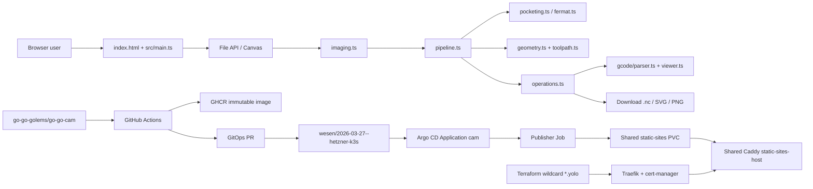

# Production Deployment Design and Implementation Guide

## Executive summary

This ticket turns the Vite application in `/home/manuel/code/wesen/2026-07-31--cat-mill-roam-fable` into a production static web application at `https://cam.yolo.scapegoat.dev`. The application is the **ABS Bicolor V-Engraver**: it accepts a raster image in the browser, creates a cleaned binary engraving mask, computes tool-center geometry, emits multi-tool Makera/GRBL-style G-code, and renders both the generated program and uploaded programs in a browser visualizer.

There is no application server, database, login flow, or server-side image upload. All artwork and G-code processing happens in the browser. Production therefore needs three distinct things:

- A reproducible Vite static artifact packaged under `/site` in an immutable public GHCR image.
- A release handoff that opens a GitOps pull request using the `static-publisher-job` strategy.
- A shared static-sites publisher Job and Ingress that let the existing Caddy host serve `cam.yolo.scapegoat.dev`.

The implementation added to the source repository is deliberately small: `Dockerfile.static`, `.dockerignore`, `deploy/gitops-targets.json`, the reusable GitHub Actions caller, and a pinned `packageManager` entry. The cluster-side package is in `wesen/2026-03-27--hetzner-k3s`, using the existing `static-sites` namespace, shared PVC, Caddy Service, public-image publisher Job, Ingress, and Argo Application. The GitHub App credential remains Vault-backed for CI's GitOps PR, but the publisher has no runtime Vault dependency.

> **Important safety boundary:** the generated G-code controls a real cutting machine. A green web deployment does not validate machining safety. Every production acceptance run must include simulation, work-offset verification, Z-zero verification, an air cut, and a stepped depth test on scrap.

## 1. Problem statement and scope

### 1.1 The product problem

A user needs a reliable, inspectable way to turn an image into shallow engraving paths for thin ABS bicolor stock. The application must preserve enough detail for narrow regions, clear broad regions efficiently, cap V-bit depth to the measured top-layer thickness plus a breakthrough margin, and produce a program compatible with the Makera-style workflow already represented by `testdata/MakeraBadge.nc`.

The input is not a vector drawing. It is a raster image with possible alpha, antialiasing, white borders, noise, holes, disconnected islands, and arbitrary scale. The system must therefore make the raster-to-machining decisions explicit and previewable rather than hiding them in a server-side black box.

### 1.2 Deployment problem

The application currently builds with Vite but did not yet have a production container, image publishing workflow, GitOps target metadata, or a cluster Application. The deployment must fit the platform's control-plane boundaries:

1. The source repository owns TypeScript, tests, the Docker build, and the image-publishing workflow.
2. The GitOps repository owns the desired Kubernetes state, image pin, ingress, namespace, and secret wiring.
3. Terraform owns DNS. In this environment, `*.yolo.scapegoat.dev` already points at the k3s ingress, so `cam.yolo.scapegoat.dev` does not require a new DNS record; this still must be checked in Terraform before rollout.
4. The public GHCR package contains only deployable frontend assets. The application has no runtime secret and the publisher does not require an image-pull credential.
5. Argo CD owns reconciliation after the first `Application` object is bootstrapped.

### 1.3 In scope

- Production static serving at `https://cam.yolo.scapegoat.dev`.
- Reproducible Node/pnpm build and container image.
- GHCR publishing and GitOps PR handoff.
- Public GHCR artifact and GitOps image-pinning contract.
- k3s publisher Job, shared static-sites Service, Ingress, and Argo Application.
- Algorithm and codebase orientation for a new intern.
- Tests, build validation, rendered-manifest validation, and post-deploy acceptance.

### 1.4 Out of scope

- Sending G-code to a CNC machine from the browser.
- Persistent user accounts, server-side storage, or multi-user authorization.
- Automatic machine-specific postprocessors beyond the existing Makera-oriented dialect.
- Replacing the current chamfer distance field with an exact Euclidean distance transform.
- Reimplementing the full Connected Fermat Spirals paper; the current implementation is an adaptation described below.
- Provisioning a new k3s cluster or installing Argo CD, Vault, VSO, Traefik, or cert-manager.

## 2. System orientation for an intern

### 2.1 Repository and runtime map

The source repository is `go-go-golems/go-go-cam` and is checked out locally at:

```text
/home/manuel/code/wesen/2026-07-31--cat-mill-roam-fable
```

The relevant source layout is:

```text
index.html                         browser structure and controls
src/main.ts                        DOM wiring and application state
src/lib/imaging.ts                 rasterization, thresholding, morphology, EDT-like field, thinning
src/lib/pipeline.ts                image-to-model-to-operations orchestration
src/lib/geometry.ts                RDP, loop tracing, skeleton graph tracing
src/lib/toolpath.ts                pixel/machine mapping and raster/detail paths
src/lib/pocketing.ts               distance-field contour pocketing
src/lib/fermat.ts                  connected Fermat-style pocketing adaptation
src/lib/operations.ts              Makera-style multi-tool G-code emission
src/gcode/parser.ts                G-code parser and statistics model
src/gcode/viewer.ts                interactive G-code visualizer
src/lib/*test.ts                   algorithm and G-code contract tests
testdata/MakeraBadge.nc            real MakeraStudio reference program
gcode-tests*/                      generated test jobs and sidecar settings
Dockerfile.static                   static artifact image containing /site
deploy/gitops-targets.json           shared workflow's static publisher patch contract
.github/workflows/publish-static.yaml reusable release workflow caller
```

The browser owns the mutable state. `AppState` in `src/main.ts` holds the loaded image, processed model, toolpaths, generated G-code, SVG, settings, and warnings. The processing pipeline is DOM-free, which is important: `scripts/generate-test-gcode.ts` can run the same core logic in Node for deterministic batch fixtures.

### 2.2 End-to-end architecture



The application can be understood as two pipelines joined at the artifact boundary:

- **Geometry pipeline:** pixels become a `Model`, then legal machine-space `Toolpath` values, then `Operation` values.
- **Delivery pipeline:** source commit becomes a container image, then a GitOps image pin, then an Argo-managed Pod.

Do not conflate these pipelines. A successful Docker build does not prove toolpath correctness. A healthy Pod does not prove a generated job is safe to cut.

## 3. Algorithmic pipeline

### 3.1 Rasterization and alpha compositing

`rasterizeImage` in `src/lib/imaging.ts` draws the source into a bounded canvas. It fills the canvas white before drawing, so transparent pixels are treated as white rather than black. Each pixel is converted to luminance with the standard Rec. 601-style weights:

```text
alpha = A / 255
r' = 255 - alpha * (255 - R)
g' = 255 - alpha * (255 - G)
b' = 255 - alpha * (255 - B)
gray = round(0.299*r' + 0.587*g' + 0.114*b')
```

This is a practical engraving choice: transparent artwork does not accidentally become engraved material. The `maxDimension` setting bounds CPU and memory cost before the image enters the pixel algorithms.

### 3.2 Threshold selection: Otsu or manual

`otsuThreshold` computes a 256-bin histogram and selects the threshold that maximizes between-class variance. For a candidate threshold `t`, let `w_b` and `w_f` be background and foreground weights, and `mu_b` and `mu_f` their means. The score is:

```text
sigma_between²(t) = w_b(t) * w_f(t) * (mu_b(t) - mu_f(t))²
```

The implementation scans all values once while maintaining cumulative counts and sums. Complexity is `O(N + 256)` for `N` pixels. `makeMask` then chooses dark pixels for engraving, or light pixels when inversion is enabled.

The OpenCV thresholding reference in `sources/03-opencv-thresholding.md` is useful because it distinguishes fixed, adaptive, binary-inverted, and Otsu thresholding. Otsu is not magic: it assumes a useful histogram separation. The UI therefore exposes manual threshold and inversion for material photographs or artwork whose histogram violates that assumption.

### 3.3 Morphological cleanup

The pipeline applies opening, closing, and connected-component filtering:

```text
opening = dilation(erosion(mask, structuring_element))
closing = erosion(dilation(mask, structuring_element))
```

`boxMorph` uses an integral image, so a square-neighborhood sum can be queried in constant time per pixel after an `O(N)` prefix pass. Opening removes small bright/foreground protrusions; closing repairs small gaps. The radius is deliberately small and user-controlled because morphology changes machinable geometry.

`removeSmallComponents` uses an 8-connected breadth-first search. It removes foreground components whose pixel area is below `minArea`. Eight-connectivity is appropriate for diagonal artwork strokes, but it also means diagonal touching pixels become one region; tests and preview inspection must cover that tradeoff.

The Bioimage Analysis morphology reference in `sources/04-bioimage-morphology.md` explains why opening and closing are not interchangeable filters. The operation order is part of the contract: changing it can turn a broken letter into a connected island or erase a narrow stroke.

### 3.4 Crop and coordinate model

When `autoCrop` is enabled, `foregroundBounds` finds the minimal foreground rectangle. The pipeline adds configurable padding, and adds additional padding when cutout mode is enabled so the outside contour has room for the cutout margin, flat-tool radius, and safety buffer.

The `Model` records:

```text
width, height        processed pixel dimensions
finishedWidth        requested physical width in millimetres
finishedHeight       width * height / width
mmPerPx              finishedWidth / width
mask, rgba           processed data and preview pixels
settings             immutable-ish run settings
centerMask, residual derived regions after planning
```

`pixelToMachine` flips the image Y axis into the machine coordinate convention, applies optional X/Y mirroring, then applies the user origin offsets. `machineToPixel` is its inverse for the Fermat start hint and visual diagnostics. Every geometry algorithm works in pixel coordinates until the path is accepted; conversion is centralized in `src/lib/toolpath.ts`.

### 3.5 Chamfer distance field

`chamferDistance` computes an approximate Euclidean distance to a foreground or background set using two raster passes. Orthogonal neighbors cost `1`; diagonal neighbors cost `sqrt(2)`. The forward pass checks left/up neighbors, and the backward pass checks right/down neighbors.

```pseudo
seed each pixel to 0 if it is a seed, otherwise INF
for y from top to bottom:
  for x from left to right:
    d[p] = min(d[p], d[left] + 1, d[up] + 1,
               d[up-left] + sqrt(2), d[up-right] + sqrt(2))
for y from bottom to top:
  for x from right to left:
    d[p] = min(d[p], d[right] + 1, d[down] + 1,
               d[down-right] + sqrt(2), d[down-left] + sqrt(2))
return d
```

The distance field is the bridge between image shape and cutter geometry. `distanceToBackground` identifies how far a foreground pixel is from leaving the artwork. Subtracting the V-bit radius produces a legal tool-center region. The implementation is a chamfer approximation, not the exact linear-time Euclidean transform in Felzenszwalb and Huttenlocher; that distinction matters if a future intern replaces it.

The paper record in `sources/05-distance-transforms-paper-html.md` and the original PDF URL record in `sources/05-distance-transforms-paper.md` explain the exact transform and why it is useful for binary images. Do not silently call the current implementation an exact EDT.

### 3.6 V-bit geometry and depth cap

The UI computes a target depth from measured material properties:

```text
D = capThickness + breakthrough
halfAngle = includedAngle / 2
surfaceWidth = 2 * D * tan(halfAngle)
toolRadius = surfaceWidth / 2
```

For a narrow detail with local half-width `w`, the ideal depth is:

```text
depth = w / tan(halfAngle)
depth = clamp(depth, minimumSafeDepth, targetDepth)
```

The cap is essential for thin ABS: unrestricted V-carving can cut through the contrasting cap layer and damage the base. `src/lib/pipeline.ts` computes the target geometry; `src/lib/toolpath.ts` computes detail depths from the distance field. Vectric's V-carve reference in `sources/09-vcarve-toolpath-reference.md` describes the same central relationship between cutter angle, width, and variable depth.

### 3.7 Broad-region clearing

The pipeline optionally uses a flat end mill for wide regions. It computes a flat-tool center region from the distance field, plans contour-parallel flat paths, and then subtracts the region reachable by that tool from the engraving mask. The V-bit is then used as a rest-machining tool for the residual shape.

Without flat clearing, the broad pocket strategy is selected by `settings.pocketStrategy`:

- `raster`: scanline runs with connector tracking in `makeRasterPaths`.
- `contour`: nested distance-field iso-contours in `makeContourPocketPaths`.
- `fermat`: connected Fermat-style paths in `makeFermatPocketPaths`.

The raster implementation preserves tracks across neighboring scanlines when a connector remains inside the center mask. This reduces retracts without pretending that disconnected runs are connected. The contour implementation extracts shrinking iso-level loops and can link compatible rings. Both are pixel-grid approximations and must be checked in the G-code viewer.

### 3.8 Connected Fermat-style pocketing

The research source at `sources/01-connected-fermat-spirals-project.md` and the ACM paper record describe Connected Fermat Spirals (CFS): decompose a connected region into subregions, fill each with a continuous Fermat spiral, then connect the local paths by a graph traversal. The goal is a globally continuous path with long low-curvature motion.

The implementation in `src/lib/fermat.ts` is intentionally documented as an adaptation, not a full reproduction of the paper:

1. `collectRings` generates nested distance-field loops.
2. `buildLoopForest` creates levels and attaches each deeper loop to the nearest loop at the previous level.
3. `decomposeChain` groups single-child nested loops into chains and leaves branches as child chains.
4. `fermatChainPath` opens each loop at an anchor, leaves a gap corridor, walks alternating rings inward, then walks the opposite parity outward.
5. `splice` inserts child-chain paths at their nearest parent vertex.
6. Close paths near a common boundary are merged when their endpoint distance is within `4 * stepover`.
7. RDP simplification converts dense pixel-space points into machine-space points.

```pseudo
rings = collectRings(distanceField, toolRadius, stepover)
forest = buildLoopForest(rings)
paths = []
for root in forest:
    chain = decomposeChain(root)
    path = fermatChainPath(chain.loops, stepover, startHint)
    for child in chain.children:
        path = splice(path, buildChainPath(child, stepover, attachmentHint))
    paths.append(path)
while two paths have nearby endpoints:
    splice them
simplify each path with RDP tolerance
convert pixels to machine millimetres
```

The important invariants are tested in `src/lib/fermat.test.ts`: a disk is one open path; annular boundaries merge; a dumbbell reaches both lobes; path points stay inside the legal center region; and total length remains comparable to contour filling. These tests are geometric regression tests, not machine-safety certification.

### 3.9 Narrow detail extraction

After broad coverage, the pipeline computes a residual region. It applies Zhang-Suen thinning to reduce the residual to a one-pixel skeleton. The implementation uses two deletion subpasses per iteration and preserves pixels when the neighborhood topology would break.

For each skeleton pixel, `traceSkeletonPolylines` builds a graph using 8-neighborhood degree. Paths start at endpoints and branch points; unvisited degree-two cycles are handled afterward. `simplifyRdp` reduces the polyline while respecting a physical tolerance. Each retained point receives a variable depth from the original distance field.

Zhang and Suen's original algorithm is archived through the source URL and a Defuddle-extracted explanatory page in `sources/06-zhang-suen-thinning-html.md`. The algorithm's preservation condition is not merely cosmetic: deleting a junction can change one connected engraving detail into two unrelated cuts.

### 3.10 Ramer-Douglas-Peucker simplification

`src/lib/geometry.ts` implements iterative RDP. It keeps the first and last points, finds the maximum point-to-segment distance, and recursively (via an explicit stack) splits whenever that distance exceeds the squared tolerance.

```pseudo
keep first and last
stack = [(first, last)]
while stack not empty:
    segment = pop()
    p = interior point farthest from segment
    if distance(p, segment) > tolerance:
        keep p
        push(left segment)
        push(right segment)
return points whose keep flag is set
```

The tolerance is converted from millimetres to pixels before simplification. This prevents a UI setting from changing meaning when the image resolution changes. Closed loops use a farthest-point strategy to choose a stable seam before simplifying two wrapped chains.

The RDP source in `sources/07-rdp-algorithm.md` is a useful general reference. It also highlights the reason to test self-intersection and corner preservation when simplifying toolpaths: fewer commands are valuable only if the simplified curve stays within the intended boundary.

### 3.11 Operations and G-code

`src/lib/operations.ts` translates toolpaths into a multi-tool program. The generated dialect includes:

- `G21`: millimetres.
- `G90`: absolute coordinates.
- `G17`: XY plane.
- `G94`: feed per minute.
- `G0`: rapid motion.
- `G1`: cutting and plunge motion.
- `Tn M6`: tool change.
- `Sn M3`: spindle clockwise on.
- `M5`: spindle off.
- `G28`, `M2`: final home/program end.
- `;@MKR|...`: Makera metadata and toolpath markers.

The three Z heights are deliberately separate:

```text
clearance: safe travel, operation boundaries, and tool changes
approach:  rapid descent before a feed plunge
hop:       short-reposition retract, followed by a feed re-engage
```

For a short reposition, the emitter uses hop height and a feed re-engage. For a long reposition, it returns to clearance. For a deeper ladder pass at the same XY, it continues straight down rather than inserting an unnecessary lift. The behavior is covered by `src/lib/pocketing.test.ts`.

`src/gcode/parser.ts` is not a full RS-274 interpreter. It supports the dialects this application needs, including linear moves, XY arcs, units, absolute/incremental mode, tools, spindle events, Makera metadata, bounds, and estimated motion time. The GRBL command reference is archived in `sources/08-grbl-commands.md`; consult the target sender/controller before adding a new command.

## 4. Public and internal APIs

### 4.1 Pipeline API

The core entry point is:

```ts
export async function runPipeline(
  input: PipelineInput,
  settings: Settings,
  jobName: string,
  onStatus?: (message: string) => void,
): Promise<PipelineResult>
```

`PipelineInput` requires `width`, `height`, and grayscale pixels; RGBA is optional for previews. `PipelineResult` returns the `Model`, `Operation[]`, generated G-code, SVG, threshold, step size, broad/residual counts, and parsed statistics.

The contract is:

- Throw when thresholding removes every foreground pixel.
- Throw when no toolpaths can be generated.
- Keep settings and coordinate transforms consistent for every path family.
- Return G-code that round-trips through `parseGcode`.

### 4.2 Geometry APIs

Important symbols for an intern:

```ts
rasterizeImage(img, maxDimension): RasterImage
otsuThreshold(gray): number
morphologicalOpen(mask, width, height, radius): Uint8Array
morphologicalClose(mask, width, height, radius): Uint8Array
chamferDistance(mask, width, height, zeroAtForeground): Float32Array
zhangSuenThin(mask, width, height, progress?): Promise<Uint8Array>
traceBoundaryLoops(mask, width, height): Point[][]
simplifyRdp(points, tolerance): Point[]
```

Do not add a second pixel-to-machine conversion in an individual algorithm. Use `pixelToMachine` and `machineToPixel` from `src/lib/toolpath.ts`.

### 4.3 Toolpath and G-code APIs

```ts
makeRasterPaths(centerMask, model): RasterPathsInfo
makeContourPaths(centerMask, model): Toolpath[]
makeDetailPaths(skeleton, originalDistance, model): Toolpath[]
makeContourPocketPaths(dist, model, toolRadiusPx, stepoverPx, depth): Toolpath[]
makeFermatPocketPaths(dist, model, toolRadiusPx, stepoverPx, depth, startHint): Toolpath[]
generateProgram(operations, model, jobName): string
parseGcode(text): ParsedGcode
```

A `Toolpath` contains a `kind`, `points`, optional constant `depth`, and `closed` flag. Detail points carry their own `depth`. An `Operation` owns a tool, paths, and a pass-depth ladder. The emitter assumes `path.points` are already in machine millimetres and that negative Z is below the measured surface.

## 5. Production delivery design

### 5.1 Source artifact

The source repository now contains:

```text
Dockerfile.static
.dockerignore
package.json                       packageManager: pnpm@10.13.1
.github/workflows/publish-static.yaml
deploy/gitops-targets.json
```

The CI test command runs the Vite build before Docker packaging. `Dockerfile.static` copies the resulting `dist/` directory to `/site` and verifies `/site/index.html`. It does not run Nginx, Caddy, `vite preview`, or Node in production. The image is an artifact carrier for the shared publisher Job.

The package manager field is necessary for reproducibility. Without it, Corepack selected pnpm 11 in a clean container and the install failed on ignored dependency build scripts. With `pnpm@10.13.1`, the build is deterministic and the lockfile remains authoritative.

### 5.2 CI and GitOps handoff

The caller invokes `go-go-golems/infra-tooling/.github/workflows/publish-ghcr-image.yml@main` with `setup_go: false`, builds `dist/`, and publishes an immutable GHCR image. `deploy/gitops-targets.json` points to `gitops/kustomize/cam/publish-job.yaml`, container `publish`, and `patch_strategy: static-publisher-job`.

That strategy rewrites every `sha-*` token in the Kubernetes Job: its name, release label, image, and shell variable. A Job template is immutable, so changing only `image:` is not sufficient. The GitHub App mode uses the `cam-gitops-pr` Vault role and must not fall back to a PAT.

### 5.3 Shared static-sites contract

The cluster package is namespaced to the existing `static-sites` namespace and contains no CAM Deployment, Service, PVC, per-site web server, or runtime Vault resources:

| Wave | Resources |
| ---: | --- |
| -2 | CAM ServiceAccount with token automount disabled |
| 1 | Static publisher Job copying `/site` into the shared PVC |
| 2 | Ingress routing `cam.yolo.scapegoat.dev` to `static-sites-host` |

The public GHCR image is pullable without credentials. The publisher writes `/srv/sites/cam.yolo.scapegoat.dev/releases/<sha>` and atomically updates `current`. The existing Caddy `static-sites-host` serves `/srv/sites/{host}/current` and supplies the client-side fallback to `index.html`. CAM has no runtime secret and no Kubernetes Vault policy or role.

### 5.4 DNS and TLS

`cam.yolo.scapegoat.dev` is covered by the existing `*.yolo.scapegoat.dev` A record in `terraform/dns/zones/scapegoat-dev/envs/prod/main.tf`, pointing to `91.98.46.169`. Confirm this remains true before rollout; do not add a duplicate record if the wildcard still covers the hostname. cert-manager requests `cam-tls` through the `letsencrypt-prod` ClusterIssuer, and Traefik routes HTTPS to the shared Caddy Service.

## 6. Deployment runbook

### Phase 0: local verification

Run from the source repository:

```bash
pnpm install --frozen-lockfile
pnpm test
pnpm build
test -f dist/index.html
docker build -f Dockerfile.static -t cam:static .
docker run --rm --entrypoint sh cam:static -c 'test -f /site/index.html'
```

Open the site through any local static server, load the embedded cat sample, choose each pocket strategy, generate G-code, inspect the visualizer, and download the `.nc` file. The output must remain a browser download; the server must never receive artwork.

### Phase 1: GitHub prerequisites

The GitHub repository is `go-go-golems/go-go-cam`. Before enabling the first push workflow:

1. Confirm `GITHUB_TOKEN` can publish the GHCR package.
2. Set the `go-go-cam` GHCR package visibility to Public using an organization owner/admin account.
3. Verify the exact SHA-tagged image can be pulled anonymously.
4. Create or verify the `cam-gitops-pr` GitHub Actions Vault role and policy.
5. Seed `kv/ci/github/cam/gitops-pr-app` with the approved GitHub App `app_id` and `private_key` without printing values.

The GitHub App credential is still required for CI to open the GitOps PR. No `kv/apps/cam/prod/image-pull` secret is needed.

### Phase 2: Source release

```bash
git push origin main
```

A pull-request run must test and build but not push an image or open a GitOps PR. A `main` push must:

- run `pnpm install --frozen-lockfile && pnpm test && pnpm build`;
- package the resulting `dist/` tree under `/site`;
- publish `ghcr.io/go-go-golems/go-go-cam:sha-<sha>`;
- authenticate to Vault using `cam-gitops-pr`;
- open a GitOps PR against `wesen/2026-03-27--hetzner-k3s`.

Inspect the PR actor, not the commit author. GitHub App mode should show the GitOps app actor.

### Phase 3: GitOps validation and first bootstrap

In the cluster repository:

```bash
cd /home/manuel/code/wesen/2026-03-27--hetzner-k3s
bash scripts/validate_gitops.sh
kubectl kustomize gitops/kustomize/cam >/tmp/cam.yaml
kubectl apply --dry-run=client -f /tmp/cam.yaml
```

The placeholder `sha-0000000` in `publish-job.yaml` must be replaced by the first GitOps PR before the Application can publish a real image. Merge the PR after checking that the image exists and the release tokens agree.

A new Application is not automatically created merely because `gitops/applications/cam.yaml` is in Git. On the first install, apply it explicitly:

```bash
export KUBECONFIG=$PWD/kubeconfig-<tailscale-host>.yaml
kubectl apply -f gitops/applications/cam.yaml
kubectl -n argocd annotate application cam argocd.argoproj.io/refresh=hard --overwrite
```

The existing `static-sites` AppProject already authorizes the `static-sites` namespace. Later image updates use the existing Application and require only the reviewed GitOps PR merge.

### Phase 4: static-site acceptance

```bash
kubectl -n argocd get application cam
kubectl -n static-sites get job,pod,ingress,certificate
kubectl -n static-sites logs job/publish-cam-<release>
kubectl -n static-sites describe certificate cam-tls
curl -fsSI https://cam.yolo.scapegoat.dev/
curl -fsS https://cam.yolo.scapegoat.dev/ | head
```

The expected state is `Synced/Healthy`, a completed publisher Job, a Ready certificate, and HTTPS content from the generated Vite bundle. There should be no CAM pull Secret or CAM Vault resources.

Then perform browser acceptance:

- Load the application over HTTPS with no console errors.
- Load the embedded cat sample.
- Upload supported image fixtures.
- Exercise Otsu, manual threshold, inversion, crop, and cleanup controls.
- Generate raster, contour, and Fermat pockets.
- Exercise optional flat clearing and cutout passes.
- Download G-code, SVG, and mask PNG.
- Load generated G-code and fixture `.nc` files in the visualizer.
- Confirm toolpath summaries, bounds, depth coloring, tool markers, spindle events, and progress slider.
- Verify that the server sees no artwork upload; all processing remains local.

For machining acceptance, simulate the G-code, inspect work offsets and tool numbers, perform an air cut, and run a stepped depth test on scrap ABS before cutting a finished part.

## 7. Validation strategy

### 7.1 Existing automated checks

The source repository currently has two Vitest files with 18 tests. Run:

```bash
pnpm test
pnpm build
```

The tests cover:

- nested and split contour rings;
- no-fit tool geometry;
- contour-linking path count and geometry;
- Fermat disk, annulus, dumbbell, and legal-region behavior;
- pass ladders;
- Makera metadata and tool ordering;
- spindle stop before tool change;
- hop versus full clearance cycles;
- direct deepening on ladder passes;
- empty operation omission.

### 7.2 Deployment checks

Use these checks at each boundary:

| Boundary | Evidence |
| --- | --- |
| TypeScript | `pnpm test`, `pnpm build` |
| Artifact image | `docker build -f Dockerfile.static`, `/site/index.html`, manifest inspection |
| GHCR | immutable image exists for the commit SHA |
| GitOps | `validate_gitops.sh`, Kustomize render, dry-run |
| Registry | public SHA-tagged image pulls anonymously |
| Argo | Application `Synced/Healthy`, rollout complete |
| TLS | trusted certificate and exact HTTPS hostname |
| Browser | no console errors, all downloads and visualizer behavior pass |
| CNC safety | simulator, air cut, depth coupon, machine-specific review |

### 7.3 Future tests worth adding

- A browser smoke test using Playwright against the built static server.
- A fixture-based pipeline test that asserts the generated G-code parses and has bounded Z depth.
- A CSP test that loads the app and asserts no blocked required resource.
- An artifact-image test that asserts `/site/index.html` and excludes non-public files.
- A publisher-manifest test that asserts the image, host, release tokens, shared PVC, and Ingress agree.
- Golden SVG/G-code snapshots for the cat sample and each test-pattern family.
- A property test that every emitted cutting point lies in the intended mask or legal center region, within the documented raster tolerance.

## 8. Design decisions

### Decision: browser-local processing

- **Context:** Artwork may be private and the current pipeline is already DOM-free and invoked from browser state.
- **Options considered:** browser-only processing; upload to a server; a worker service.
- **Decision:** browser-only processing.
- **Rationale:** no image retention, no server-side attack surface, simple static deployment, and direct visual feedback.
- **Consequences:** large images consume browser CPU/memory; processing cannot be centrally audited; users must download and validate G-code themselves.
- **Status:** accepted.

### Decision: shared static-sites publisher instead of a per-site server

- **Context:** Vite emits static assets and the k3s platform already has a shared Caddy host backed by a static-sites PVC.
- **Options considered:** per-site Nginx Deployment; Node `vite preview`; shared static-sites publisher Job.
- **Decision:** package `/site` in GHCR and publish it with the shared static-sites Job.
- **Rationale:** fewer workloads, one serving implementation, atomic release directories, and an existing platform contract already used by other Vite/Storybook sites.
- **Consequences:** the site depends on the shared PVC/Caddy service and its namespace; a future backend requires a separate application deployment.
- **Status:** accepted.

### Decision: GHCR plus GitOps image handoff

- **Context:** this k3s platform reconciles desired state from the GitOps repository and already provides a shared image-publish workflow.
- **Options considered:** manual `kubectl set image`; direct CI cluster credentials; GHCR plus GitOps PR.
- **Decision:** GHCR immutable image followed by a reviewed GitOps PR.
- **Rationale:** separates build credentials from cluster authority, preserves an auditable image pin, and uses the existing Argo operating model.
- **Consequences:** first installation needs explicit Application bootstrap; a release can stop at any boundary and needs boundary-specific diagnostics.
- **Status:** accepted.

### Decision: public GHCR package for the static artifact

- **Context:** the CAM image contains only public Vite frontend assets, and the shared publisher needs an immutable artifact source.
- **Options considered:** public GHCR with anonymous pulls; private GHCR plus Vault/VSO pull Secret; a separate object-storage delivery path.
- **Decision:** publish the SHA-tagged GHCR package publicly and remove CAM's runtime Vault/image-pull wiring.
- **Rationale:** avoids minting and rotating a registry credential for an intentionally public artifact while preserving the existing GHCR → GitOps PR → Argo delivery chain.
- **Consequences:** every file in `/site` is public; Docker artifact contents must be audited before release. The GitHub App credential remains Vault-backed because CI still opens GitOps PRs.
- **Status:** accepted.

### Decision: retain chamfer distance as the current distance field

- **Context:** the existing pipeline is pixel-based and has a tested two-pass chamfer implementation.
- **Options considered:** retain chamfer; implement exact Felzenszwalb-Huttenlocher EDT; add a geometry library.
- **Decision:** retain chamfer for this deployment.
- **Rationale:** deployment should not mix an algorithm migration with a release migration; current tests define the existing behavior.
- **Consequences:** small geometric error remains near diagonal boundaries; a future exact-EDT change needs geometry and G-code regression tests.
- **Status:** accepted.

### Decision: call the Fermat implementation an adaptation

- **Context:** the CFS paper decomposes arbitrary connected regions and connects subregion spirals through a graph traversal; the code uses distance-field rings, nearest-loop parenting, chain paths, and splicing.
- **Options considered:** claim full CFS equivalence; remove the strategy; document the adaptation and test its invariants.
- **Decision:** document it as a Connected Fermat-style adaptation.
- **Rationale:** accurate attribution protects future maintainers from assuming stronger guarantees than the implementation provides.
- **Consequences:** complex concave regions need fixture validation and possibly future topology improvements.
- **Status:** accepted.

## 9. Risks, alternatives, and open questions

### Risks

- A thin ABS cap can be cut through if the measured `capThickness` is wrong.
- A browser can freeze or run out of memory on an oversized image; `maxDimension` is a guard, not a formal resource budget.
- Chamfer distance and pixel contours introduce grid quantization.
- Path simplification can change narrow corners or produce an unsafe near-boundary path if tolerance is too large.
- G-code syntax accepted by the parser may still be rejected or interpreted differently by a sender/controller.
- The current workflow's `@main` dependency is mutable; pinning a reviewed infra-tooling ref would improve supply-chain reproducibility.
- The GitHub Actions role binds push to `main`; manual workflow dispatch is intentionally not a valid GitOps release path.
- The first deployment is blocked until the GitHub App credential path is seeded in Vault and the GHCR package is confirmed public and anonymously pullable.

### Alternatives

- **Cloudflare Pages:** simpler static hosting, but bypasses the requested k3s/Argo platform and the existing release train.
- **Per-site Nginx Deployment:** rejected because the cluster already provides a shared Caddy/PVC publisher model for static sites.
- **Private GHCR package:** retained as a fallback if organization policy later disallows public packages; it would restore the Vault/VSO pull-secret contract.
- **Exact Euclidean distance transform:** potentially improves geometry, but is an algorithm change outside this deployment ticket.
- **Server-side CAM worker:** could provide queueing and heavier processing, but would require authentication, uploads, persistence, and a new threat model.

### Open questions

1. Should the shared static-sites host expose a per-site cache policy or security-header configuration?
3. Should the reusable workflow ref move from `@main` to a reviewed commit after the first successful rollout?
4. What exact Makera machine profile and sender version are the acceptance targets for G-code?
5. Should the UI eventually expose a machine profile instead of hard-coding Makera metadata defaults?
6. Should a future ticket replace chamfer distance with exact EDT and add property-based geometry bounds tests?

## 10. References and file index

### Source files

- `/home/manuel/code/wesen/2026-07-31--cat-mill-roam-fable/index.html` — application controls, preview canvases, downloads, and visualizer.
- `/home/manuel/code/wesen/2026-07-31--cat-mill-roam-fable/src/main.ts` — browser event wiring and `AppState`.
- `/home/manuel/code/wesen/2026-07-31--cat-mill-roam-fable/src/lib/imaging.ts` — image algorithms.
- `/home/manuel/code/wesen/2026-07-31--cat-mill-roam-fable/src/lib/pipeline.ts` — orchestration and depth cap.
- `/home/manuel/code/wesen/2026-07-31--cat-mill-roam-fable/src/lib/toolpath.ts` — coordinate transform and path construction.
- `/home/manuel/code/wesen/2026-07-31--cat-mill-roam-fable/src/lib/geometry.ts` — simplification and graph tracing.
- `/home/manuel/code/wesen/2026-07-31--cat-mill-roam-fable/src/lib/pocketing.ts` — contour pocketing.
- `/home/manuel/code/wesen/2026-07-31--cat-mill-roam-fable/src/lib/fermat.ts` — Fermat-style pocketing.
- `/home/manuel/code/wesen/2026-07-31--cat-mill-roam-fable/src/lib/operations.ts` — G-code emitter.
- `/home/manuel/code/wesen/2026-07-31--cat-mill-roam-fable/src/gcode/parser.ts` — parser and statistics.
- `/home/manuel/code/wesen/2026-07-31--cat-mill-roam-fable/src/lib/fermat.test.ts` — Fermat invariants.
- `/home/manuel/code/wesen/2026-07-31--cat-mill-roam-fable/src/lib/pocketing.test.ts` — contour and G-code invariants.

### Deployment files

- `/home/manuel/code/wesen/2026-07-31--cat-mill-roam-fable/Dockerfile.static`
- `/home/manuel/code/wesen/2026-07-31--cat-mill-roam-fable/.github/workflows/publish-static.yaml`
- `/home/manuel/code/wesen/2026-07-31--cat-mill-roam-fable/deploy/gitops-targets.json`
- `/home/manuel/code/wesen/2026-03-27--hetzner-k3s/gitops/kustomize/cam/`
- `/home/manuel/code/wesen/2026-03-27--hetzner-k3s/gitops/kustomize/static-sites-host/`
- `/home/manuel/code/wesen/2026-03-27--hetzner-k3s/gitops/applications/cam.yaml`
- `/home/manuel/code/wesen/2026-03-27--hetzner-k3s/gitops/projects/static-sites.yaml`
- `/home/manuel/code/wesen/2026-03-27--hetzner-k3s/vault/policies/github-actions/cam-gitops-pr.hcl`
- `/home/manuel/code/wesen/2026-03-27--hetzner-k3s/vault/roles/github-actions/cam-gitops-pr.json`
- `/home/manuel/code/wesen/terraform/dns/zones/scapegoat-dev/envs/prod/main.tf` — existing wildcard DNS.

### Archived web research

The full Defuddle extracts and URL records are stored under this ticket's `sources/` directory. Start with the CFS project page, OpenCV thresholding tutorial, morphology chapter, distance transform paper record, Zhang-Suen explanation, RDP article, GRBL command reference, and V-carve reference.
